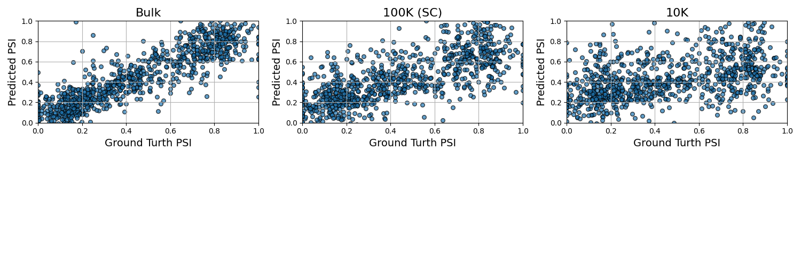

# ASPIRE: Accurate alternative splicing prediction from limited RNA sequencing data and a minimal gene set

Alternative splicing is a fundamental biological mechanism that increases protein diversity and regulates critical cellular processes across eukaryotes. Dysregulation of splicing is implicated in a wide range of diseases, including cancer, neurological disorders, and autoimmune conditions. Accurate prediction of splicing metrics such as percent spliced in (PSI) is therefore essential for understanding splicing regulation and improving disease characterization. However, existing approaches typically require high sequencing depth and are thus poorly suited for low-coverage settings such as single-cell RNA sequencing, where sparse read counts limit reliable splicing analysis. Here, we present ASPIRE (Accurate Splicing Prediction from Limited RNA Sequencing), a deep learning framework for predicting alternative splicing metrics from low-depth RNA-seq gene expression data. ASPIRE infers PSI values from gene expression profiles with limited read coverage and incorporates an embedded feature selection mechanism that identifies a minimal, informative subset of genes relevant to splicing regulation. This design enables accurate prediction while reducing reliance on extensive sequencing and mitigating noise introduced by irrelevant or weakly informative genes. By focusing on biologically meaningful features, including RNA-binding proteins, ASPIRE maintains strong predictive performance even under conditions typical of single-cell transcriptomics. We demonstrate that ASPIRE accurately predicts PSI values across a range of sequencing depths, including those characteristic of single-cell RNA-seq, and performs comparably to or better than existing methods in both simulated and real datasets. By enabling robust expression-based splicing inference from sparse data, ASPIRE facilitates the study of alternative splicing at cellular resolution and provides a practical framework for investigating splicing regulation in development, disease, and heterogeneous cell populations.

